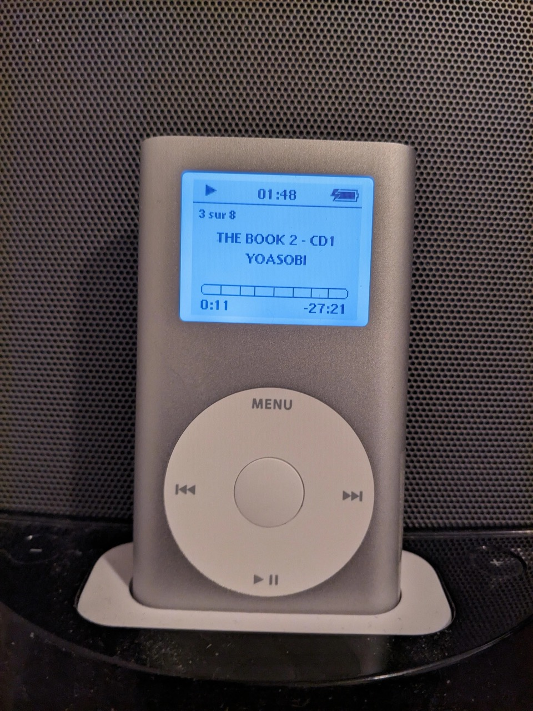

# Gapless playback on unsupported iPods with Stock OS + Store 10x more songs without issues + Improve UI responsiveness + Improve boot time: it's time to regroup your songs by albums !
*Date: 23 December 2024*



# Introduction
## Glossary
### What is Gapless playback ?
Some CDs (especially live performances) were mastered to provide a gapless experience, which means the different tracks will chain with a clean transition that does not contain any kind of silence. This is very immersive. Properly tagged AAC/ALAC/MP3 files contains the gapless playback metadata but you need an iPod Nano 2nd gen or an updated iPod Video (5th gen) to get gapless playback with the Stock OS.

### About responsiveness
The iPod Stock OS is storing a lot of metadata all time in the RAM of your iPod. The last iPods (the Classics) can handle much more songs. More you have songs, more your iPod will struggle: slow UI, bugs in iPod Clickwheel Games (iPod Video), and crashs or empty menus when shuffling all songs are caused by a too much amount of songs (and related metadata).

### About boot time
At boot or when you unplug the USB card from your PC, the iPod need to cache many data in RAM which will take a lot of time. The last iPods (the Classics starting 6th+ gen) can do this operation much faster. Also, black & white iPods have less data to cache so these also go faster. The slowest is the iPod Video; mine can take a few minutes to boot to cache its 30000 songs.

### About Rockbox
You can use Rockbox to enjoy gapless playback among other cool things like themes and handle bigger music libraries. But Rockbox need time to adapt yourself and you maybe want to use your iPod only through the Apple ecosystem and how it was intended to be used. The Stock OS is very good and reliable for what it was designed to do. Also Rockbox had some very rare niche case unsolved bugs even today. For example, on my iPod Mini 2nd gen, when it is SD modded (with iFlash or the Red CF adapter), the battery life will be divided by more than by the huge factor of 3 which results in a total of 6 or 7 hours of battery life versus more than 23 hours in the Stock OS.

# Explanations about the trick
*Did you know that Apple themselves sold "Non-Stop Mix" versions of popular albums from 2005 in their iTunes Store back in the day, to compensate the fact that no iPod could do gapless ?* https://www.journaldulapin.com/2016/10/20/itunes-gapless/ 

We are going to transform all your albums into single files then import these single files into iTunes for syncing. These files will contains chapters, just like audiobooks ! So it will look pretty clean and legit on the iPod; think of it just like a CD player/jukebox that has no idea anymore of what song is currently played. You put the CD in, then enjoy the music, and that's the kind of experience that you will replicate by organizing your music like this.

**It is strongly recommended** that you learn before how to encode using the old AAC Apple encoder, and it is also strongly recommended that you keep all your FLAC dumps somewhere as your ultimate archive that you can use anytime you need to build a new library for one of your portable device (an iPod, a smartphone, etc).

## Advantages
- Since the title will now be the album name, the iPod Mini will natively be able to show you what album is currently playing without having to use a custom firmware to do it in a strange looking way.
- We are going to take advantage of the "chapters" function in the AAC format that Apple designed primarily for audiobooks, which means that you can quickly navigate through songs in the album by clicking the previous/next song buttons.
- Your CDs will play completely gapless on your old iPod so you can enjoy playing the music how it was intended by the artist
- You will reduce insanely your total metadata amount in the iPod library which means it will boot faster, shuffle all will work again (if it was broken for you because of your insane amount of music), and navigation will be (much) faster too. If your iPod is modded with 128GB or more and if you had a lot of music, you will definitely see a difference.

## Disadvantages
- The "repeat one" feature will become kinda pointless since it will be albums based, so you will need yourself to press the rewind button at the end of the song to play it again. But if you really love a specific song, you can still extract it yourself to an individual file and make as much exceptions as you need to put your "best songs of all time" in one playlist that you will maintain.
- You will not know anymore what artists made/composed a specific song and what is the title of the currently played song (but you can still Shazam your docked iPod or open a .m4a album music file on Foobar2000 to see again all the titles that are contained in the album individually). iTunes can see the titles of each chapters each when you play a song, though.
- You can't rate an individual chapter which means you will rate directly the whole album file and your smart playlists will update accordingly
- Your iTunes music library will look kinda messy on your computer
- You will lose flexibility and have to stick with full albums when you transfer music
- You lose the ability to shuffle all tracks of an album or all tracks from your library (but if you had too much music, shuffling all tracks from your library was probably broken anyway)
- Forget about dual booting with Rockbox and sharing one music library for both: Rockbox ignores completely the chapters in these single-file albums (Rockbox can't understand chapters metadata, no matter if it is a Nero or a QuickTime metadata) and seems to have trouble to parse the titles also from my tests, so navigation is not very convenient.
- The search feature from the iPod Videos/iPod Classics will become way less relevant since it will not be able to find titles.

This new organization of your files implies compromises; take this decision with intelligence by asking yourself these 5 questions:
- How much do I value gapless playback ?
- How much do I value Stock OS ?
- How many tracks do I have and want to have on my iPod ? If this number is under around 10 000 (or 20 000 with Classics), you will not get a huge speed boost in most of the cases.
- Am I ready to invest time at building a new lossy library that I will need to maintain alongside my main lossless library ?
- Am I ok with the fact that my iPod will become essentially a full-albums player ? Finding songs for you may be much more difficult if you don't know what's inside your albums. But if you do, navigation inside is pretty quick thanks to chapters. On monochrome iPods you will also not be able to help yourself with album illustrations which will reward very highly your memory skills at knowing what is exactly inside your iPod.

# The technical guide
This guide is Windows-only. Some parts can be replicated pretty easily on MacOS, though, excepted the core conversion with the old AAC encoder. Produced files with this guide can be imported on any Mac or iTunes version. Modern Macs should use a Windows virtual machine to do the following steps.

1. Install the latest Foobar2000 version (you can even install the ARM64 version if your machine is an ARM64 one) : [https://www.foobar2000.org/download](https://www.foobar2000.org/download) If you want to sync your iPod using Foobar2000 rather than iTunes, you must install the x86 version
2. Install the Foobar2000 encoders pack : [https://www.foobar2000.org/encoderpack](https://www.foobar2000.org/encoderpack)
3. Install the QuickTime 7.6.6 portable encoder that I provide for convenience to integrate directly with Foobar2000. If you don't trust me, you can check the SHA256/signatures of the files, and even make yourself your own portable encoder files by using the ```qt-2015-makeportable.cmd``` file that I provide in this archive. Copy and replace the unzipped content of [gapless-lagless-oldapple/foobarencoders.7z](gapless-lagless-oldapple/foobarencoders.7z) inside the folder ```foobar installation folder/encoders```. Replace any existing files if it asks to.
4. Inside the ```foobar installation folder/encoders``` folder, rename ```refalac64.exe``` to ```disabledrefalac64.exe``` and ```qaac64.exe``` to ```disabledqaac64.exe``` because we want Foobar2K to use our 32 bits version that will use the 32 bits QuickTime binaries. QuickTime 7.6.6 was compiled only in 32 bits to convert music files (and qaac architecture need to match with the arch of QTFiles).
5. [Video guide](gapless-lagless-oldapple/foobar2k.mp4) You should now be able to do the converts directly from the Foobar2000 UI: 
	1) Scan some (lossless if possible) music to convert. Click on ```Library``` (located in the top menu of the app) then click on ```Configure```, a new window will appear. On the left of this window, click on ```Media Library``` then you can add your ```Music folders``` by clicking the adequate ```Add...``` button. Compared to iTunes, Foobar2K will scan everything, even FLAC files, and will be able to convert from them. Now that your library is scanned into Foobar2000, you can close this window with the ```OK``` button.
	2) In the dropdown view (bottom-left of the window), select ```by album``` (this is **very important** or albums will not be grouped correctly by CDs)
	3) Now right-click on ```All music``` then select ```Convert``` then select ```...```
	4) Click on ```Output format``` then double-click on ```AAC (Apple)```
	5) Bit rate mode must be: ```Constrained VBR``` and the quality ```128 kbps``` or ```160 kbps```. If you really need to save disk space, you can go down to 96 kbps (but it will not feel transparent enough all time). Any bitrate more than 128kbps will give diminishing returns perceptually more you increase the bitrate. If you don't know what to choose and want absolute guarantee that it will be very safely transparent even for Classical music (which is one of the most complex music type to compress), choose ```160 kbps```.
	6) Now click ```Ok``` to close the encoder configuration window, then click ```Back```. In ```Output format```, you should now see ```AAC (Apple), CVBR```
	7) Now click on ```Destination``` then check ```Generate multi-track files``` (should be already checked) then put this pattern: ```%album artist%/$if(%album%,%album% - CD$if(%discnumber%,%discnumber%,1),%album%/%filename%)``` which will be clean, simple and without conflicts if your music is properly tagged. One file will be created and chaptered for each CD.
	8) Now click on ```Back```; the new destination pattern should appear under the ```Destination``` clickable link. You can now ```Save <<``` your new preset with a custom name so you can re-use it anytime later (for example it can be: ```Apple AAC QuickTime Gapless```).
	9) Now you can ```Load >>``` your preset anytime you want then click on the ```Convert``` button to start converting the music files into the destination folder of your choice.

6. [Video guide](gapless-lagless-oldapple/convertchapters.mp4) The converted files are chaptered by using the Nero format, and iTunes don't understand it and has its own format for chaptering. So we need to use a program to convert chapters. Get this tool that I compiled for you [gapless-lagless-oldapple/mp4chaps.7z](gapless-lagless-oldapple/mp4chaps.7z) and copy it inside the ```destination folder containing your converted music``` then double click on ```open cmd here.bat``` to open a console window. Copy paste this command on the opened console window: ```for /R %f in (*.m4a) do (mp4chaps -Q -c "%~sf")``` (to paste the command, press ```right-click``` on your mouse in the inside of the terminal window). This will process all the .m4a files to convert their chapters format from ```Nero``` to ```QuickTime (iTunes)```.

7. [Video guide](gapless-lagless-oldapple/mp3tag.mp4) We are going to update the metadata of our produced files to make them more friendly to read. This step is important and should not be ignored or all grouped files will look strange/bad on device and on iTunes.
	1) For that, you need to install and start this tool: [https://www.mp3tag.de/en/download.html](https://www.mp3tag.de/en/download.html)
	2) Download my configuration file and extract it: [gapless-lagless-oldapple/Mp3tagSettings.7z](gapless-lagless-oldapple/Mp3tagSettings.7z)
	3) From the top menu of the app, click on ```File``` then on ```Open configuration folder```. Copy the content of the archive ```Mp3tagSettings.7z``` into this configuration folder. This will add the new action ```iPod Processing``` to your ```Actions``` menu.
	4) Now drag & drag the folder containing all your converted music to add the music into the mp3tag UI. You can now select all the songs (the quickest way is to click on one song then use the ```CTRL+A``` shortcut on your keyboard).
	5) From the top menu of the app, click on ```Action``` then on ```iPod Processing```. This will take a while. Metadata will be sanitized, correctly formatted and cleaned for all of your tracks.

8. Then you can copy the produced files and import these on your favourite iTunes/Apple Music version. I recommend to disable completely "Sound Check" (https://support.apple.com/en-us/109331) on iTunes to avoid un-necessary very long processing times on iTunes when you will import your files. Apple Sound Check was designed for independent titles, not for full albums. If the scanning process is already started, you can stop it (by clicking on the cross icon in the status bar) and sync your music straight away. You can disable Sound Check completely on your iPod, it will be useless because there's no metadata to read about it anyway.

## What if I want to add more music in the future ?
Now that your PC/Windows virtual machine is properly configured to convert and process the metadata, it is getting easier for next times. To add more songs, just open Foobar2K to convert the new songs, then run the mp4chaps script to convert the chapters from Nero to QuickTime. Then, run mp3tags to apply the action ```iPod Processing``` on all the files. All done ! The files are processed and high quality; ready to import and synced to your device through iTunes.

# Support my work
You can tip me on Patreon: https://www.patreon.com/Olsro