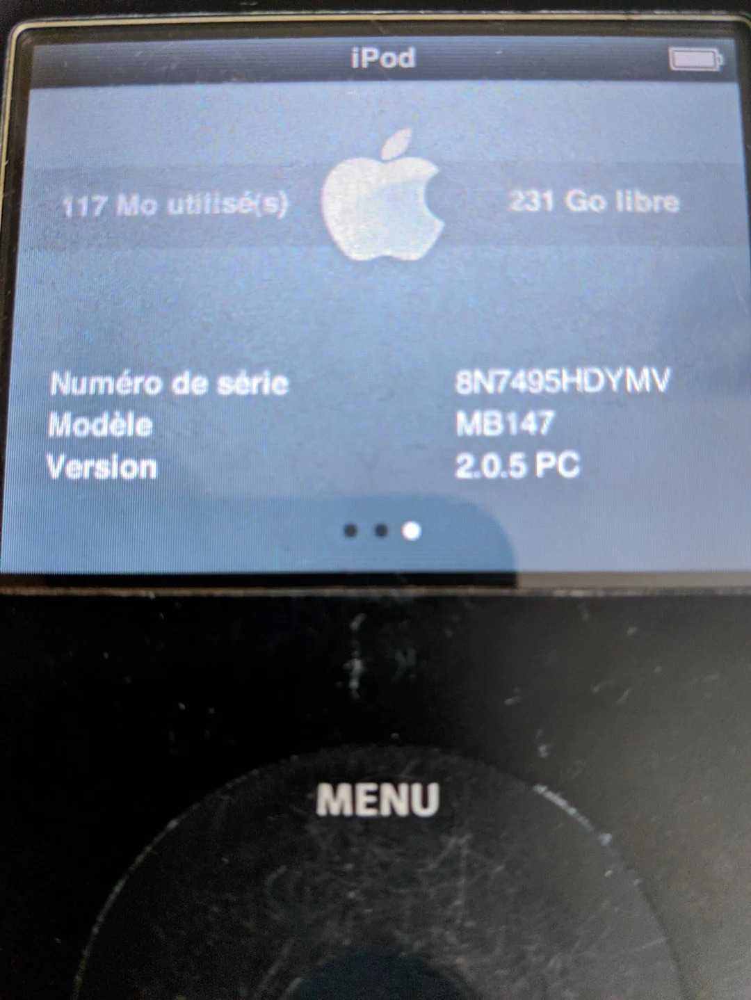

# Larger (> 128GB) flashmods on any iPod Classic 6G Stock OS by flashing more recent firmwares
*Date: 09 July 2025, last edited: 09 July 2025*



## Introduction
All iPod Classics 6G are not equals. Some of them are limited to the firmware 1.1.2 (6G, 80GB/160GB fat), while others (6.5G 120GB) can't go past the 2.0.1 firmware.

Also, some people claims that the 6G sounds bad on the firmware 1.1.2.

Considering these drawbacks, 7G Classics iPods are the most appealing for the power user. But since all 6G/7G iPod Classics are almost identical hardware-wise, what if we could modify some internal stuff to erase most software differences to get a better experience ?

In this guide you will learn how to change factory-coded versions on your iPod (serial number, model revision, etc) in order to flash and use a more modern Stock OS version that supports largest available flashmods.

This mod do require **only an internet-enabled Windows PC and your iPod**. You do not need to do any kind of soldering on your iPod or any kind of hardware modding, it's **purely software**.

## This guide was in early access during one week
This guide implied a lot of tests and developing new tools to reduce the risk of mistakes that can affect your beloved music player.
I also had to buy myself a 6G and a 6.5G and mod/repair these myself so I can tinker on them and test that everything is allright.

It's a lot of dedicated time and an original work, so this guide like the others that I made had a one-week early access period for my supporters in Patreon.

Now that one week has passed, everything is open-sourced for everyone as I believe in free knowledge with as less gate keeping as I can justify to keep the fun stuff accessible for all and especially for those who can't afford it.

**Donating on my Patreon** help me to cover my research costs and the time that I can allocate to update my old guides and help the users in a case-per-case basis: https://www.patreon.com/Olsro

## Some context before diving technical
### Real-world changelog for Apple firmwares and EU volume limit scientific testing
*Based on my own experience in heavily testing them.*

2.0.2: Add support for larger flashmods (> 128GB)
2.0.3: Add Genius mixes
2.0.4: Some niche bug fixes, all documented by Apple (Fixed HE-AAC content playback / Fixed iTunes U content organization / Fixed truncated text in Genius Mixes)
2.0.5: On EU-iPods, there's a new option to enforce the EU volume limit. There's also an alert the first time you increase the volume over the EU volume limit. This alert reset itself after a while, which will reset the volume limit under the EU restriction, and this can be annoying because it can happen during music playback.

About the EU volume limit, I connected all my iPod Classics to my PC (with a jack-to-jack) port then I used a site that can access my microphone to do loudness tests online. All iPod Classics 6G+ don't have **any** EU restriction, they all sound the exact same (excepted the 2.0.5 one if I enable the option to enforce the EU volume limit).

So in contrary from all popular beliefs, 2.0.5 is the worse choice for an EU iPod user because it add annoyances that were not here in legacy firmwares.

### Advantages of doing this
- It should make your iPod Classic 6.0G sounding better. From my tests, it is sounding exactly like my later iPod Classics on the 2.0.2 firmware. It looks like bad sound also affected the iPod Nano 3G that used closely the same firmwares on 1.1.X. 6.5G was shipped with 2.0.1 so was not affected by this.
- Larger flashmods will be supported. Enjoy up to 2TB of content if that's your desire ! =) But if you wanna be smart and cost-effective, I strongly advise you check my other guides to compress your music & videos with excellent perceptual quality.
- Once the flashing process is applied fully, it is very stable and you can even use iTunes at any time later to restore your iPod again. There's no known broken features, everything should work as normal from my testing: videos playback, docking, remote controls, accessories (like the FM Radio Remote), music playback, syncing stuff, etc

### Disadvantages of doing this
- 2.0.2-2.0.4 firmwares requires at least iTunes 9 to sync. This can be a problem if you've planned to sync using a very old Mac, like a PowerPC G3 Mac that will be stuck to iTunes 8.
- 2.0.5 firmware requires at least iTunes 10 to sync
- Finder app on Sonoma seems incompetent at restoring an iPod from DFU... use an old Mac/Windows computer for best results. **A Windows computer is strongly recommended** because they will restore your iPod as a Windows-formatted iPod and it's easier on these machines to flash the Rockbox bootloader. This guide will cover only a Windows part for the moment.
- This process implies to modify mostly readonly data on the iPod, and can semi-brick it if you are not carefull
- I had random crash/freezes when my iPod 6.5G was playing music on my digital dock Onkyo ND-S1 on the 2.0.4/2.0.5 firmware. These crashs happenned only in this context, and stopped completely once I downgraded to 2.0.2.
- A 6th gen iPod (80GB/160GB fat) can be flashed to 2.0.5 but remote controls/microphone from the headphones will (still) not be available to you. It seems like this model is lacking some hardware to support it (and changing the back cover by another won't help, the missing hardware seems to be in the logic board itself).
- You will lose all data from your iPod, **there's no way to upgrade it without doing a full wipe**

### Personal result
My NVMe 1TB modded 6.5th gen (that should be locked to 128GB) has now around 20 000 44.1/16 ALAC songs, some podcasts/audiobooks and around 3000 videos. It handles all no problem and sees the entirety of available storage. I still have around 277GB of free space right now on that beast, and iTunes sees all the storage too. It's running on firmware 2.0.2.

## Disclaimer
You need to know that installing more modern firmwares is untested by Apple as Apple did not want you to do this. So far, I can confirm that surprisingly everything seems to run like normal. I tested clickwheel games, videos, music, accessories, docks, and all acts like normal and battery life is good. I used my 6.5th and my 6th gen modded as a daily pod during several days; and the iPod never crashed when I was listening for hours on the go using my headphones.

These modifications won't allow you to modify the firmware, just to install other signed firmwares bundles from other iPods exactly as they are and how Apple built them years ago.

I am not a big company but just an individual who tinker with stuff and like to share discoveries with the community. I won't take any responsibility from bricked stuff, but all my work is open source so you can control my source codes/methods and everything transparently to know exactly what run on your device.

My graphical tool limits greatly the risks of flashing an invalid file by doing some checks compared to using an hex editor directly on the file, but flashing a SYSCFG is not something you should do often as it is a kind of memory that was designed to be readonly 99,9999% of the time. If you mess things up, your iPod will become a brick (at least in Stock OS/iTunes, maybe if you don't mess things too much Rockbox will still work because it does not care about the state of the SysCFG, but you don't want that and me too.

I want also to ask people to act responsible and to always sell their iPod with a clean backup of the "syscfg" file so the buyer can revert to default and real data. Transparency is important for a better world.

Remember that especially 6.0th gens board are not as capable as later boards; they lack support for headphone remote controls, so if you sell SYSCFG flashed iPods as 7.5th gens, buyers may be disappointed by the lacking feature when they will try to use remote buttons (or to record themselves using the microphone of the headphones, which is also lacking). So again, be **transparent** about the device you sell to others.

## How to upgrade your iPod to 2.0.2 (Windows only instructions)
Why 2.0.2 exactly ? Because later versions are not interesting and caused a rare instability on my device. **2.0.2 feels exactly like 2.0.1** (last supported version for the 120GB model), but with larger flashmods support.

If you really need Genius Mixes, you can flash 2.0.4 but **I don't recommend it**. Stability is more important than niche features in my opinion, even if I could personally reproduce the crash only in a very specific context (docked to my digital dock playing music) and rarely (once per day max).

Also you need to know that because of a bug, you cannot flash again the Rockbox bootloader on 2.0.2. So if you are interested to dual boot Rockbox, you will need to flash your iPod to **2.0.4** instead because it looks like the Rockbox team never bothered testing their bootloader with the old 2.0.2 firmware...

To do this tutorial, you need a Windows computer connected to the Internet, and an iPod with a stable and working storage (avoid doing that on an iPod that has a cooked mechanical hard drive as it increase the risk that you will flash a corrupted SysCFG).

1) Download and install required files
- iPod Firmware 2.0.2: https://secure-appldnld.apple.com/iPod/SBML/osx/bundles/061-6797.20090909.3uTfE/iPod_35.2.0.2.ipsw
- A good iTunes version (I use iTunes 12.10.11.2 on Windows 7 but this version is confirmed to work also on Windows 11). Latest iTunes version (12.13.7.1) is known to **not** work !!! Even the version from outside the Windows Store can't restore properly an iPod in DFU Mode. To downgrade your iTunes, you will need to uninstall all related Apple programs and to rename/delete your music folder.
- Rockbox Utility: https://www.rockbox.org/wiki/RockboxUtility#Download
- My custom Rockbox build that add the flashing tools: [ipod6g-flash-more-recent-firmwares/ipodclassic6g-rockbox-full-with-flashtools.zip](ipod6g-flash-more-recent-firmwares/ipodclassic6g-rockbox-full-with-flashtools.zip)
- iPod SysCFG Editor (graphical tool coded by me to assist you at modifying iPod rom contents): [Windows](ipod6g-flash-more-recent-firmwares/iPodSysCFGEditor_ForWindows.7z) [MacOS (Apple Silicon)](ipod6g-flash-more-recent-firmwares/iPodSysCFGEditor_ForMacs_AppleSilicon.7z)

Links to an old and known working iTunes version:
- iTunes 12.10.11.2 (Use that link only if your computer is a **32 bits** one): https://secure-appldnld.apple.com/itunes12/001-80042-20210422-E8A351F2-A3B2-11EB-9A8F-CF1B67FC6302/iTunesSetup.exe
- iTunes 12.10.11.2 (Use that link only if your computer is a **64 bits** one): https://secure-appldnld.apple.com/itunes12/001-80053-20210422-E8A3B28C-A3B2-11EB-BE07-CE1B67FC6302/iTunes64Setup.exe

1) Flash the Rockbox bootloader using the Rockbox utility (flash only the bootloader, nothing else is necessary, **untick** all other boxes in the utility). You can help yourself using this video guide for this step: https://www.youtube.com/watch?v=JwZZBC2JTHU
2) Install my custom Rockbox build that includes the flashing tools by unzipping the ```ipodclassic6g-rockbox-full-with-flashtools.zip``` archive, then copy the ```.rockbox``` folder into the root of your iPod. 
3) Bootup Rockbox on your iPod and dump your SysCFG. To do that, on your iPod go on the ```System -> Debug (Keep Out!) -> View and save SysCfg (from NOR to file)```. After a few second, the SysCFG from your iPod should be displayed and the last line should be ```Syscfg file has been saved !```.
4) Connect your device to your PC (you can do that while staying in Rockbox) then **backup your SysCFG somewhere safe** !
5) You can now open the ```iPod SysCFG Editor``` tool and load a **copy** of your SysCFG into it (from the ```File``` menu).
6) On bottom left of the UI, click on the ```Apply Edit Preset``` button then on the recommended option to ```Turn into 2.0.2-2.0.4 compatible iPod```. The tool will do all the complex work at changing the right values for you.
7) From the ```File``` menu of the program, select ```Save``` to write the new SysCFG into the hard drive of your iPod. Your edited SysCFG must be into a file named ```syscfg``` into your iPod.
8) Disconnect your iPod from your PC, plug it into a wall plug, then boot again into my modified Rockbox build.
9) Flash your modified SysCFG. To do that, go to ```System -> Debug (Keep Out!) -> Flash SysCfg (from file to NOR)```. After a few second, the modified SysCFG should be displayed and the last line should be ```Syscfg file has been flashed to NOR in 2 attempts !```.
10) Your iPod needs now to enter a special restore mode: the DFU mode. DFU mode is necessary so iTunes can restore the appropriate internal firmware:
10.1) Connect the device to a computer using a USB cable.
10.2) Hold down both the ```Select (Center)``` and ```Menu``` button.
10.3) The device will reboot. Keep holding both buttons.
10.4) After at least 8 seconds, release both buttons.
10.5) The screen should remain black from now. If not, retry until it does.
11) iTunes will ask you to download a restore image. Accept.
12) After a while, your iPod will appear back in iTunes. It's now time to time to SHIFT + Click on the ```Restore``` button on iTunes. A file browser will open, so it's time to choose the downloaded ```iPod_35.2.0.2.ipsw``` so you will restore your iPod to 2.0.2.
13) After a while, your iPod will reboot and be ready to go on its newer firmware. The Rockbox bootloader has been removed entirely through the restore process, so if you want Rockbox you must install the bootloader again.

You can now use your iPod as normal, it is now on the 2.0.2 firmware. Don't update it to 2.0.4, use it as-it-is. Put some content, it's now where the usage of your music buddy starts, you've finished the hard work. Time to reward yourself with a drink, maybe ?

If anything can be improved to make better/more clear instructions, feel free to contact me. If you are a YouTuber/journalist that want to cover my work, it's important too that you contact me as it's important to not spread any false info about something that can brick the device from people, I will be happy to talk.

Tip me on Patreon: https://www.patreon.com/Olsro

### Troubleshooting
#### I get an iTunes Error 1675 when restoring the recovery image
You are using too modern Apple software that is bugged, so you must downgrade iTunes to the recommend version then retry.

#### iTunes could not connect to the iTunes Store. An unknown error occured (0x80090302)
This is an SSL error. Maybe your computer has outdated root certs ?
You may want to install Charles Proxy: https://www.charlesproxy.com/download/latest-release/
1) Install root certs ```Help -> SSL proxying -> Install Charles Root Certificate```
2) Enable SSL host to: ```s.mzstatic.com```
3) Connect your iPod again in DFU mode and retry from step 11. iTunes should now be able to pull the restore files just fine from Apple secured servers. **During that time, Charles should keep running in the background to proxy the requests !**

#### Songs skipping / unstable iPod
You may try:
1) Try to sync it again (you do not need to put back your music, just press the sync button once then eject your iPod).
2) Reboot your iPod (maintain MENU + CENTER button until it reboot)
3) If this is still not enough, I am afraid your storage hardware itself is unstable. If you use iFlash, avoid SanDisk cards. You may try to install your storage device again.

I used my reflashed iPod during countless of hours without issues on 2.0.2 (docked & undocked), so it will be stable if your storage device itself is stable.

#### I lost my SysCFG backup and want to restore back my iPod to its original firmware
Use the advanced mode with the iPod SysCFG Editor and put these values:

##### iPod Classic 6.0G (80GB/160GB)
Serial number: 
*Change the 3 last digits to (depending on what model you want) :*
YMV = Classic 6th Gen (Black, 80GB)
Y5N = Classic 6th Gen (White, 80GB)
YMX = Classic 6th Gen (Black, 160GB)
YMU = Classic 6th Gen (White, 160GB)

Hardware version: 130000
Firmware ID: 132A1448
Software version: 1.0
Model number: MB147
Sales region: 00020001 00020001

##### iPod Classic 6.5G (120GB)
Serial number: 
*Change the 3 last digits to (depending on what model you want) :*
2C7 = Classic 6.5th Gen (Black, 120GB)
2C5 = Classic 6.5th Gen (White, 120GB)

Hardware version: 130100
Firmware ID: 137070E2
Software version: 2.0
Model number: MB562
Sales region: 00020001 00010020

## Additional documentation for power users
### SysCFG detailed stuff
*Raw data retrieved using a SysCFG dump and an Hex editor (Hex Fiend), so they are different compared to what you will see using my tool and it's normal as my tool formats values.*
*This is just some info for more advanced users who wants to understand better what happens under the hood.*

#### 2.0.5 SysCFG patches for a 2.0.4 iPod
I recommend patching:
- Firmware ID to ```00000001 83B60125 00270A00```
- Hardware version to ```00031300```
- Sales region to ```01000200 2000A100```

#### Serial number (SrNm)
- Cosmetic change in the iPod settings
- Used by iTunes/Finder to know the color of your iPod (black or white)
- This is (surprisingly) not used by DRM so you can change it freely and clickwheel games will continue to work.

#### Firmware ID (FwId)
```00000001 83B60125 00270A00``` for a 2.0.5 7th gen
```00000001 C1CA4D21 00270A00``` for a US 2.0.4 7th gen
```00000001 714D4121 00270A00``` for a EU 2.0.4 7th gen

This must match the desired iPod type or iTunes will refuse to sync the device.

#### Hardware ID (HwId)
The utility from this is unknown; it seems not used for DRM (tested with games and they continued to work after a change).

#### Hardware version (HwVr)
```00011300``` for a 120GB 6th gen
```00021300``` for a 2.0.4 7th gen
```00031300``` for a 2.0.5 7th gen

This is crucial to boot the more recent OS

#### Codec (Codc)
SB on both of my iPod

#### Software version (SwVr)
Can be 2.0.4 or 2.0.5 for example

This seems only to be cosmetic in the SysCFG and won't affect the ability to sync/boot the installed OS. The installed OS also don't extract the value from SysCFG to show you its current version.

##### Logic board serial number (MLBN)
The utility from this is unknown; it seems not used for DRM (tested with games and they continued to work after a change).

#### Model number (Mod#)
MC297 is 2.0.4 7th gen
MC293 is 2.0.5 7th gen

This seems only to be cosmetic and won't affect the ability to sync/boot the installed OS.

#### Sales region (Regn)
EU 2.0.5 iPod is ```01000200 2000A100```
EU 2.0.4 iPod is ```01000200 20002100```

On 2.0.5 only, EU pods have the option to disable the volume limit. If I use the values from my 2.0.4 iPod, I can't see anymore the option to disable EU volume limit in the menu (probably because the iPod thinks it's an US pod ?)
